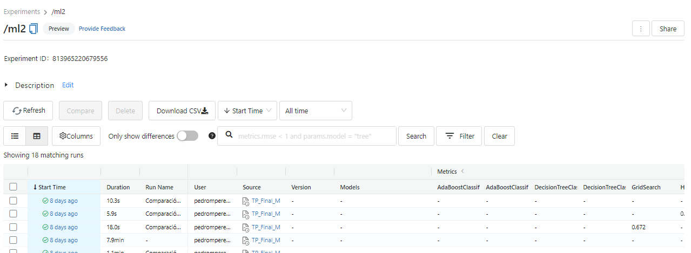
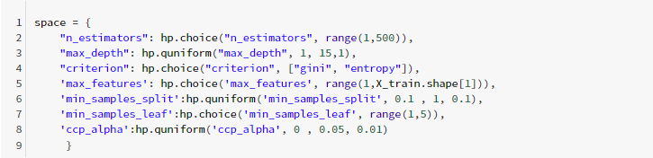
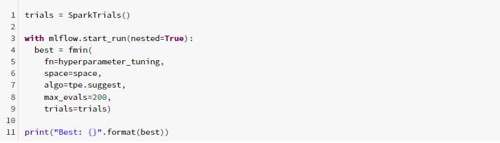
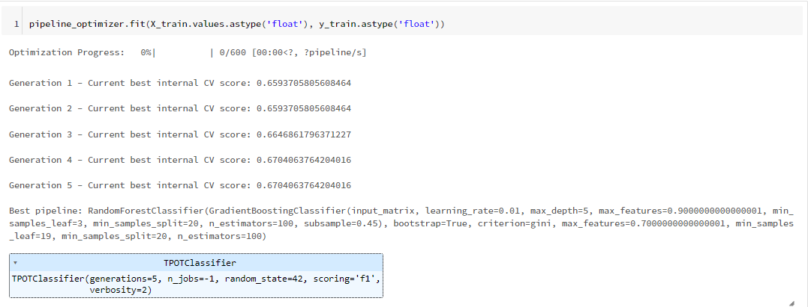
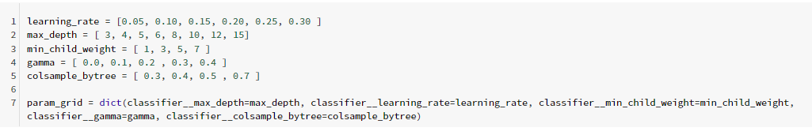
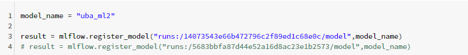
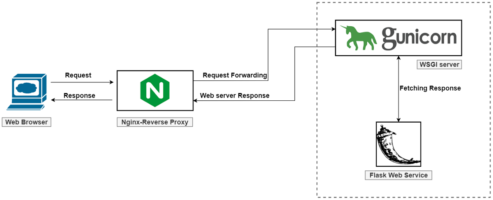
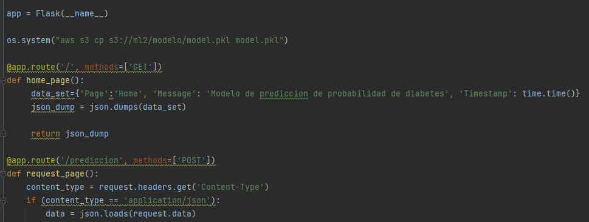
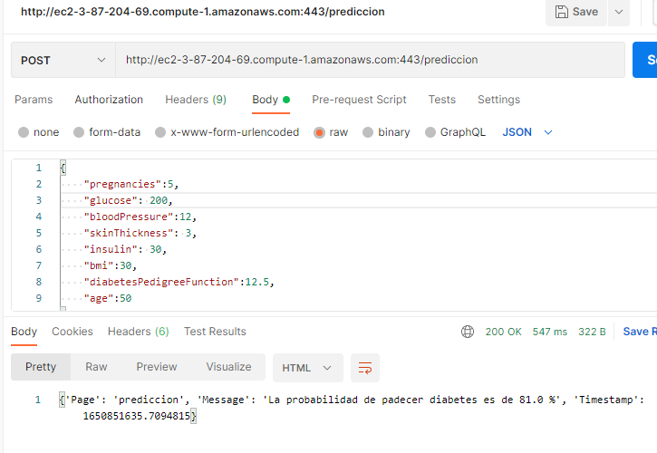

[

# Machine Learning 2 (ML)

_Este repositorio contiene el código correspondiente al proyecto final de la asignatura machine learning 2 de la Especialización en inteligencia artificial (CEIA) de la Universidad de Buenos Aires (UBA).📖_

---

## 1. Análisis y procesamiento:

En esta etapa se realiza el análisis exploratorio y procesamiento de los datos. Todas las métricas fueron registradas utilizando la herramienta MLFlow. [TP_Final_ML_2_Exploracion.ipynb](notebook/TP_Final_ML_2_Exploracion.ipynb)).

La herramienta Databrick y su integración con MLflow permitió realizar una seguimiento de todas las métricas y crear un experimento en la cual se pudieran almacenar las mismas con el respectivo modelo:

    

## 2. Tunning Hyperparametros:

Se probaron diferentes técnicas de optimización de hyperparametros con el fin de determinar cual tenía mejor performance, los resultados de las métricas fueron almacenados utilizando MLflow:

####  Hyperopt:

La librería [Hyperopt](http://hyperopt.github.io/hyperopt/) permite definir un espacio de búsqueda de hyperparametros a optimizar:

    

Se define el número de evaluación en conjunto con la función de optimizacion:

    

#### Tpot:

La librería Tpot es una librería que se encarga de realizar autoML utilizando programación genética:

El resultado de la optimización con Tpop nos permitió obtener el mejor clasificador posible:

    

#### GridSearch:

El método de [Gridsearchcv](https://scikit-learn.org/stable/modules/generated/sklearn.model_selection.GridSearchCV.html) es parte de la librería de Ski-learn el cual permite realizar una busqueda intensiva de hyperparametros en un espacio definido:

    

## 3. Puesta en producción del modelo:
Una vez optimizados los hyperparametros del modelo el mismo es exportado como pkl y subido a un bucket S3 de AWS para ser consumido:

    

    

## 4. Creación API AWS:

    

La idea es disponibilizar un EndPoint en producción utilizando Flask como Web service, Gunicorn como servidor Gataway y Nginx como servidor proxy.

#### Flask:

Flask es un marco web de Python pequeño y ligero que proporciona herramientas y funciones útiles que hacen que crear aplicaciones web en Python sea más fácil.

    

#### Gunicorn:
Gunicorn es un servidor WSGI son las siglas de Web Server Gateway Interface. Es una especificación que describe cómo se comunica un servidor web con una aplicación web, y cómo se pueden llegar a encadenar diferentes aplicaciones web para procesar una solicitud/petición (o request).

    

#### Request API:
Una vez que nuestro servicio se encuentra levantado nos da la posibilidad de realizar request HTTP Post para obtener resultados:

    

---

## Autor  ✒️
Pedro Miguel Pérez

## Contacto 📌
Contact me by mail _pedromperezc@gmail.com_ or by my personal [LinkedIn](https://www.linkedin.com/in/pedromiguelperez/)

---]()