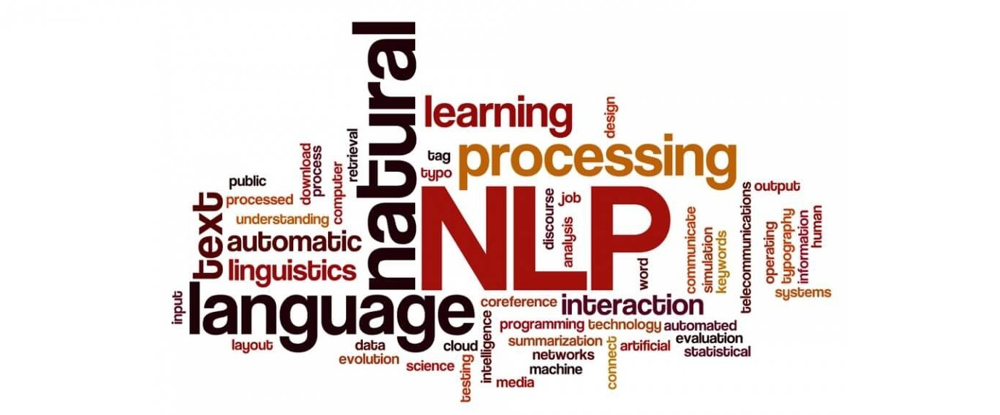

[
# Procesamiento del Lenguaje natural
Este repositorio contiene el material de clases (presentaciones, ejercicios y notebooks) para NLP (CEIA - FIUBA)

---

## Contenido:

### [Desafío 1](Desafio_1_word2vec.ipynb) 
* Introducción a NLP (natural language programing)
* Vectorización de documentos

### [Desafío 2](Desafio_2_Bot_DNN_Spacy_esp.ipynb) 
* Tokenización de documentos.
* Lemmatization.
* Stop words.
* Librerías de procesamiento de lenguaje natural.

### [Desafío 3](Desafio_3_Custom_embedding_con_Gensim.ipynb) 
* Custom embedddings con Gensim.
* Word Embeddings.
* CBOW y SkipGram.

### [Desafío 4](Desafio_4_Predicción_Palabra.ipynb) 
* Redes neuronales recurrentes.
* One-to-One.
* One-to-many.
* Text prediction

### [Desafío 5](Desafio_6_Bot_seq_to_seq.ipynb) 
* Sequence to sequence.
* Traductores y bots conversacionales.

# Profesores
:octocat: Msc. Rodrigo Cardenas Szigety\
:octocat: Esp. Ing. Hernán Contigiani

## Autor  ✒️
:octocat: Pedro Miguel Pérez

## Contacto 📌
Contacto por mail _pedromperezc@gmail.com_ o por mi linkedin personal [LinkedIn](https://www.linkedin.com/in/pedromiguelperez/)