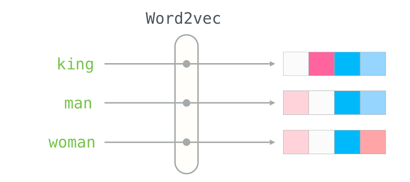

# Procesamiento del Lenguaje natural
Este repositorio contiene el material de clases (presentaciones, ejercicios y notebooks) para NLP (CEIA - FIUBA)

---

## Contenido:

### [Clase 1](Desafio_1_word2vec.ipynb) 
* Introducción a NLP (natural language programing)
* Vectorización de documentos

    

### [Clase 2](Desafio_2_Bot_DNN_Spacy_esp.ipynb) 
* Tokenización de documentos.
* Lemmatization.
* Stop words.
* Librerías de procesamiento de lenguaje natural.

### [Clase 3](Desafio_3_Custom_embedding_con_Gensim.ipynb) 
* Custom embedddings con Gensim.
* Word Embeddings.
* CBOW y SkipGram.

### [Clase 4](Desafio_4_Predicción_Palabra.ipynb) 
* Redes neuronales recurrentes.
* One-to-One.
* One-to-many.
* Text prediction

# Profesores
:octocat: Msc. Rodrigo Cardenas Szigety\
:octocat: Esp. Ing. Hernán Contigiani